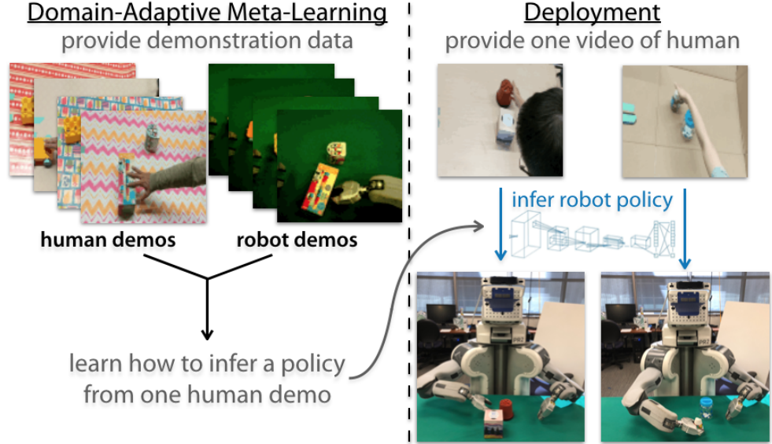
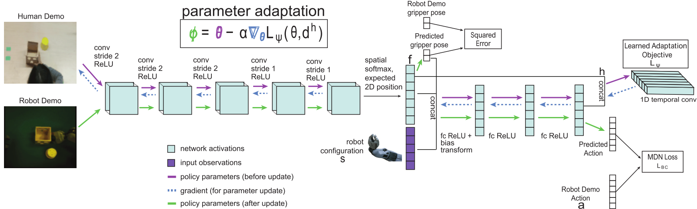
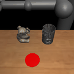
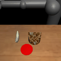
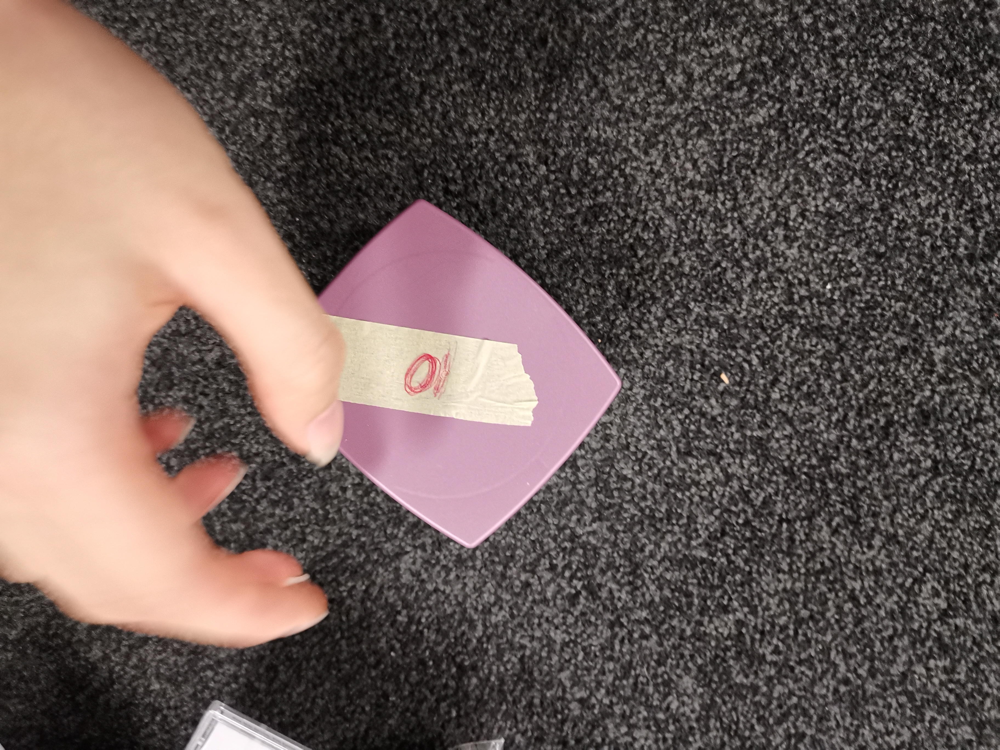

# Domain-Adaptive Meta-Learning for One-Shot Imitation learning
## with Pytorch implementation
1. This project refer to [2018:One-Shot Imitation from Observing Humans via Domain-Adaptive Meta-Learning](https://arxiv.org/abs/1802.01557);

2. The author's code repository:[https://github.com/tianheyu927/mil](https://github.com/tianheyu927/mil);

3. The code implements two models with pytorch, [simulatted pushing experiment](#simulating-pushing) and [pushing experiment](#pushing).

## Model structure
<p align="center">
  
  <p align="center"> DAML process illustration[DAML](https://arxiv.org/abs/1802.01557)</p>
</p>
<p align="center">
  
  <p align="center">DAML network structure[DAML](https://arxiv.org/abs/1802.01557)</p>
</p>

## Environment
- Pytorch 1.3.1, conda with python 3.7.4
- numpy
- pillow

## Usage
### Simulating pushing
To download data, run
```
./scripts/get_data.sh
```

Set the model in `main.py` to `model_sim`, code in `model_sim.py`.

Simulated pushing is a simplified case that it uses robot demo and does not include state prediction
Gym relevent code is not included, you have to write it yourself, please refer to [https://github.com/tianheyu927/mil](https://github.com/tianheyu927/mil) and check its code for detail.



### Pushing
Set the model in `main.py` to `model_pushing`, code in file `model_pushing.py`, the default model parameters are set with the same values as in the paper.
#### collected data
the collected data is labeled with the number of objects shown in the images, the first number is the target.
<p></p>





### a typical scene

## How to use your own data?
Data should be prepared in accordance with what `dataloader.py` describes:
- `image height/width/channel`: the input images, corresponding to the input data;
- `states`: Robot states or configuration, which consists of the pose of the end-effector represented by the 3D position of 3 non-axis-aligned points on the gripper, please check the `dataloader.py` for correctly build your own dataset;
- `action`: groundtruth includes 3 linear velocities, 3 rotation velocities and 3 gripper pose for the loss computation;
- `gripper_pose_min/max`: the index in the action vector that indicates the pose of gripper, which is used for the gripper pose loss calculation;
- Manually adjust padding layer
